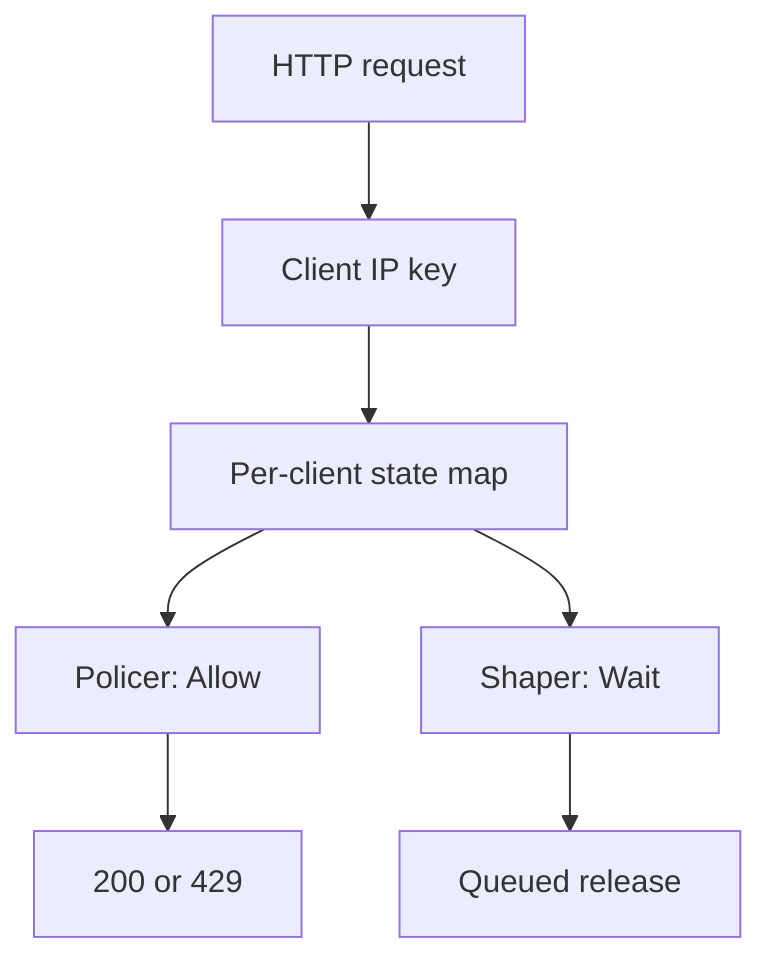

# Concurrent Rate Limiting in Go

A small engineering case study that implements and evaluates multiple rate-limiting strategies under bursty, concurrent, and HTTP workloads.

The project was built from scratch to answer a practical question:

> How do different rate-limiting strategies behave under bursts and concurrent access, and which implementation costs remain visible inside an HTTP server?

It is an educational project, not a production-ready distributed rate limiter.

## What is implemented

- **Token Bucket** — allows controlled bursts and refills over time.
- **Leaky Bucket Policer** — accepts or rejects immediately using a continuously leaking level.
- **Sliding Window Log** — tracks accepted request timestamps in a fixed-size ring buffer.
- **Leaky Bucket Shaper** — queues requests and releases them at a fixed interval.
- Per-client state keyed by IP address.
- HTTP middleware returning `200` or `429` with `Retry-After` where applicable.
- Unit, concurrency, cancellation, queue-capacity, and race-detector tests.
- Reproducible burst, shaper, microbenchmark, contention, and HTTP experiments.

## Key findings

1. **Token Bucket and the Leaky Bucket Policer behaved almost identically** under equivalent burst and recovery settings.
2. **Sliding Window enforced the strictest post-burst behavior**, rejecting requests until the original timestamps left the one-second window.
3. **The Leaky Bucket Shaper actually smoothed traffic**, releasing ten queued requests roughly 100 ms apart.
4. A global exclusive map lock was limiting independent clients. Replacing it with `sync.RWMutex` reduced median multi-client cost by approximately **29–31%** with four threads.
5. Differences measured in nanoseconds became much smaller inside the HTTP server, where networking and `net/http` dominated more of the total cost.

The detailed methodology, raw interpretation, limitations, and conclusions are available in [REPORT.md](REPORT.md).

## Design



Policers expose an immediate decision:

```go
type IRateLimiter interface {
	Allow(key string) (bool, time.Duration)
}
```

The shaper uses a separate blocking contract:

```go
type RateLimiterWaiter interface {
	Wait(ctx context.Context, key string) error
}
```

The state map uses `sync.RWMutex`, while each client bucket or window owns a separate `sync.Mutex`. Existing clients can be looked up concurrently, but updates to one client's state remain serialized.

## Results

### Burst and recovery

Configuration: capacity 10 and an equivalent rate of 10 requests per second. The workload sent 20 immediate requests followed by one probe every 100 ms.

| Policy | Initial burst | First retry | Recovery |
|---|---:|---:|---|
| Token Bucket | 10 accepted / 10 rejected | ~99 ms | one request every ~100 ms |
| Leaky Bucket Policer | 10 accepted / 10 rejected | ~99 ms | one request every ~100 ms |
| Sliding Window | 10 accepted / 10 rejected | ~999 ms | blocked until ~1,003 ms |

### Leaky Bucket Shaper

Ten concurrent requests were queued with a 100 ms leak interval.

```text
Completion: 100, 200, 300, 401, 500, 600, 700, 801, 900, 1000 ms
Gap:        100, 100, 100, 100,  99, 100, 100, 100,  99,  100 ms
```

The policers process an allowed burst immediately. The shaper spreads the same work across approximately one second.

### Saturated sequential path

This benchmark measures only repeated rejection for an already saturated client.

| Policy | Median | Observed range | Allocations |
|---|---:|---:|---:|
| Token Bucket | 182.1 ns/op | 176.6–190.5 ns/op | 0 allocs/op |
| Leaky Bucket Policer | 181.8 ns/op | 179.9–182.6 ns/op | 0 allocs/op |
| Sliding Window | 155.6 ns/op | 145.3–160.5 ns/op | 0 allocs/op |

This does **not** establish that Sliding Window is universally faster. No timestamps expired during the measured section, so this represents its cheapest saturated path.

### Map-lock optimization

Median cost with four threads, before and after replacing the map's exclusive `Mutex` with `RWMutex`:

| Policy | Workload | Mutex | RWMutex | Change |
|---|---|---:|---:|---:|
| Token Bucket | same key | 284.1 ns | 282.1 ns | -0.7% |
| Token Bucket | many keys | 216.9 ns | 152.4 ns | **-29.7%** |
| Leaky Bucket | same key | 260.4 ns | 283.8 ns | +9.0% |
| Leaky Bucket | many keys | 195.2 ns | 138.2 ns | **-29.2%** |
| Sliding Window | same key | 242.7 ns | 233.4 ns | -3.8% |
| Sliding Window | many keys | 176.6 ns | 121.7 ns | **-31.1%** |

`RWMutex` helped when goroutines read existing map entries and updated different buckets. It did not remove contention when every goroutine targeted the same bucket.

### HTTP end-to-end

Each run sent 5,000 requests over loopback with concurrency 32. Policers were configured to accept 2,500 requests and reject 2,500. Values below are medians from five runs.

| Case | Throughput | p50 | p95 | p99 |
|---|---:|---:|---:|---:|
| No limiter | 28,999 req/s | 601 µs | 1,863 µs | 3,095 µs |
| Token Bucket | 27,142 req/s | 626 µs | 2,072 µs | 3,801 µs |
| Leaky Bucket Policer | 24,915 req/s | 672 µs | 2,398 µs | 4,085 µs |
| Sliding Window | 27,726 req/s | 639 µs | 2,032 µs | 3,298 µs |

No client errors occurred during the 100,000 requests executed across all HTTP runs.

These numbers describe one local machine and one synthetic workload. They are not production capacity claims.

## Choosing a strategy

| Strategy | Useful when | Main trade-off |
|---|---|---|
| Token Bucket | an API should allow small controlled bursts | does not enforce a perfectly uniform rolling window |
| Leaky Bucket Policer | a continuously recovering backlog model is desired | little behavioral difference from Token Bucket in this implementation |
| Sliding Window Log | the last `T` seconds must contain at most `N` requests | stores up to `N` timestamps per client |
| Leaky Bucket Shaper | downstream work must arrive at a steady rate | adds queueing latency and worker lifecycle costs |

## Running the project

Requires Go 1.22 or newer.

Run the demonstration server:

```bash
go run .
```

Run the validation suite:

```bash
go test -count=10 ./...
go test -race -count=5 ./...
go vet ./...
```

## Reproducing the experiments

```bash
mkdir -p results

go run ./cmd/burst-experiment \
  > results/burst.csv

go run ./cmd/shaper-experiment \
  > results/shaper.csv

go test ./policies \
  -run '^$' \
  -bench '^BenchmarkSaturatedSequential$' \
  -benchmem \
  -count=5 \
  | tee results/sequential.txt

go test ./policies \
  -run '^$' \
  -bench '^BenchmarkSaturatedConcurrent$' \
  -benchmem \
  -cpu=1,2,4 \
  -count=5 \
  | tee results/concurrent-after-rwmutex.txt

go run ./cmd/http-experiment \
  > results/http.csv
```

Expected result files:

```text
results/
├── burst.csv
├── shaper.csv
├── sequential.txt
├── concurrent-before-rwmutex.txt
├── concurrent-after-rwmutex.txt
└── http.csv
```

## Project structure

```text
.
├── cmd/
│   ├── burst-experiment/
│   ├── shaper-experiment/
│   └── http-experiment/
├── policies/
│   ├── token_bucket.go
│   ├── leaky_bucket.go
│   ├── leaky_bucket_shaper.go
│   ├── sliding_window.go
│   └── benchmark_test.go
├── utils/
│   └── deque.go
├── results/
├── REPORT.md
├── README.md
└── go.mod
```

## Limitations

- In-memory state only; no distributed coordination or persistence.
- No eviction for inactive client entries.
- The current shaper keeps one worker goroutine per key.
- A canceled shaper request remains queued until a later tick discards it.
- Synthetic local workloads on one low-core machine.
- No TLS, reverse proxy, real network latency, weighted requests, or multi-process deployment.
- Five benchmark repetitions and medians, without inferential statistical analysis.

See [REPORT.md](REPORT.md) for the full discussion of methodology and limitations.
